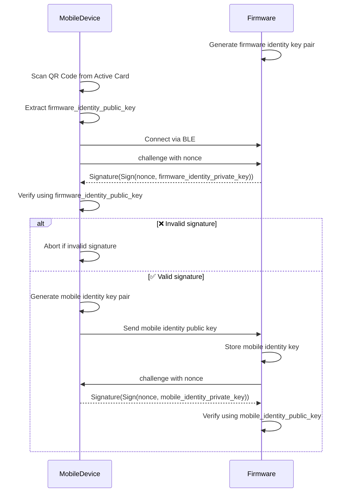
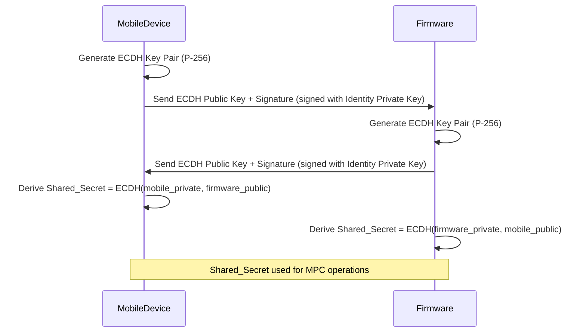

# Active Card and Mobile App BLE Pairing + MPC Workflow

This document outlines the enhanced BLE pairing protocol using QR code + Challenge-Response, identity key exchange, ECDH key exchange, and secure session setup for MPC initialization between the **Mobile Device** (User + App) and the **Active Card**.

## 0. Transport Layer

All messages in the protocol are wrapped in a `TransportMessageWrapper` that provides:
- Message type identification
- Session management
- Encryption support
- Payload encapsulation

### 0.1 Transport Message Structure

```protobuf
message TransportMessageWrapper {
  uint32 message_type = 1;      // Maps to ActiveCardEvent.id
  uint32 message_size = 2;      // Size of serialized payload
  bytes session_id = 3;         // Session identifier
  uint64 session_start_time = 4; // Session creation timestamp (ms)
  bytes contents = 5;           // Serialized inner message
  uint32 iv_len = 6;           // AES IV length
  uint32 tag_len = 7;          // AES authentication tag length
  bytes iv = 8;                // AES initialization vector
  bytes tag = 9;               // AES authentication tag
  bool is_encrypted = 10;      // Encryption status flag
}
```

### 0.2 Message Types (ActiveCardEvent)

Each command in the protocol maps to a specific `ActiveCardEvent` enum value:

```kotlin
enum class ActiveCardEvent(val id: Int) {
    NONCE_REQUEST(1),                    // Request for random nonce
    NONCE_RESPONSE(2),                   // Response with nonce
    SIGNED_NONCE(3),                     // Signed nonce for verification
    SIGNATURE_VERIFICATION_RESULT(4),     // Result of signature verification
    SEND_IDENTITY_PUBLIC_KEY(5),         // Exchange identity public key
    SEND_ECDH_PUBLIC_KEY(6),             // Exchange ECDH public key
    ECDH_EXCHANGE_ACK(7),                // Acknowledge ECDH exchange
    SEND_USER_IDENTITY(8),               // Send encrypted user identity
    PAIRING_CONFIRMATION(9),             // Confirm pairing status
    FORGET_DEVICE(10),                   // Request to forget device
    FORGET_ACK(11)                       // Acknowledge device forget
}
```

The `message_type` field in `TransportMessageWrapper` uses these enum values to identify the type of message being transported.

## 1. Secure BLE Pairing with QR Code + Challenge-Response (Identity Key Exchange)

### 1.1 Sequence Diagram




### 1.2 QR code data format

```plain
{
  "identityPublicKey": "BASE64_ENCODED_PUBKEY",
  "deviceId": "DEVICE-UUID-1234",
  "deviceName": "AC-Bob-Key",
  "ownerUser": "bob@example.com",
  "firmwareVersion": "1.0.3",
  "timestamp": 1715148123
}
```

### 1.3 Commands & Messages

#### NONCE_REQUEST
* Request for random nonce from firmware
* Wrapped in `TransportMessageWrapper`:
  - `message_type = 1` (NONCE_REQUEST)
  - `contents = []` (empty payload)

#### NONCE_RESPONSE
```protobuf
message NonceResponse {
  bytes nonce = 1;
}
```
* Wrapped in `TransportMessageWrapper`:
  - `message_type = 2` (NONCE_RESPONSE)
  - `contents = serialized(NonceResponse)`

#### SIGNED_NONCE
```protobuf
message SignedNonce {
  bytes signature = 1; // ECDSA Signature of the nonce using firmware's private key
}
```
* Wrapped in `TransportMessageWrapper`:
  - `message_type = 3` (SIGNED_NONCE)
  - `contents = serialized(SignedNonce)`

#### SIGNATURE_VERIFICATION_RESULT
```protobuf
message SignatureVerificationResult {
  bool valid = 1;
  string reason = 2; // e.g. "invalid signature"
}
```
* Wrapped in `TransportMessageWrapper`:
  - `message_type = 4` (SIGNATURE_VERIFICATION_RESULT)
  - `contents = serialized(SignatureVerificationResult)`

#### SEND_IDENTITY_PUBLIC_KEY
```protobuf
message IdentityPublicKey {
  bytes pubkey = 1;
  string source = 2; // "mobile"
}
```
* Wrapped in `TransportMessageWrapper`:
  - `message_type = 5` (SEND_IDENTITY_PUBLIC_KEY)
  - `contents = serialized(IdentityPublicKey)`

## 2. ECDH Key Exchange and Shared Secret Derivation

### 2.1 Sequence Diagram: Shared Secret Establishment




### 2.2 Commands & Messages

#### SEND_ECDH_PUBLIC_KEY
```protobuf
message ECDHPublicKey {
  bytes pubkey = 1;
  string source = 2; // "mobile" or "firmware"
}
```
* Wrapped in `TransportMessageWrapper`:
  - `message_type = 6` (SEND_ECDH_PUBLIC_KEY)
  - `contents = serialized(ECDHPublicKey)`

#### ECDH_EXCHANGE_ACK
```protobuf
message ECDHExchangeAck {
  bool success = 1;
  string reason = 2;
}
```
* Wrapped in `TransportMessageWrapper`:
  - `message_type = 7` (ECDH_EXCHANGE_ACK)
  - `contents = serialized(ECDHExchangeAck)`

## 3. Ownership Association

### 3.1 Sequence Diagram: Pairing Confirmation and User Binding


### 3.2 Commands & Messages

#### SEND_USER_IDENTITY
```protobuf
message UserIdentity {
  bytes encrypted_user_id = 1;
}
```
* Wrapped in `TransportMessageWrapper`:
  - `message_type = 8` (SEND_USER_IDENTITY)
  - `contents = serialized(UserIdentity)`

#### PAIRING_CONFIRMATION
```protobuf
message PairingConfirmation {
  bool confirmed = 1;
}
```
* Wrapped in `TransportMessageWrapper`:
  - `message_type = 9` (PAIRING_CONFIRMATION)
  - `contents = serialized(PairingConfirmation)`

## 4. Session Management

### 4.1 Reconnect


### 4.2 Forget Device


#### FORGET_DEVICE
* No payload; command triggers erasure of pairing data
* Wrapped in `TransportMessageWrapper`:
  - `message_type = 10` (FORGET_DEVICE)
  - `contents = []` (empty payload)

#### FORGET_ACK
```protobuf
message ForgetAck {
  bool erased = 1;
}
```
* Wrapped in `TransportMessageWrapper`:
  - `message_type = 11` (FORGET_ACK)
  - `contents = serialized(ForgetAck)`

## 5. Notes

*   All public keys use `secp256r1`
*   Signatures are done with `ecdsa.SignASN1`
*   Shared secret is used with AES-GCM for message encryption
*   QR Code must include firmware's static identity public key for verification
*   Identity key is generated from go-sdk by method `generateIdentityKeypair`
*   All messages are wrapped in `TransportMessageWrapper` for:
    - Secure transport
    - Session management
    - Message type identification (using ActiveCardEvent enum)
    - Encryption support
*   Session management is handled automatically by the transport layer
*   Messages are encrypted using AES-GCM once a shared secret is established
*   Each message includes proper IV and authentication tag for encryption
*   Message types are defined in `ActiveCardEvent` enum and mapped to `message_type` in wrapper
*   Commands without payloads use empty `contents` array in wrapper