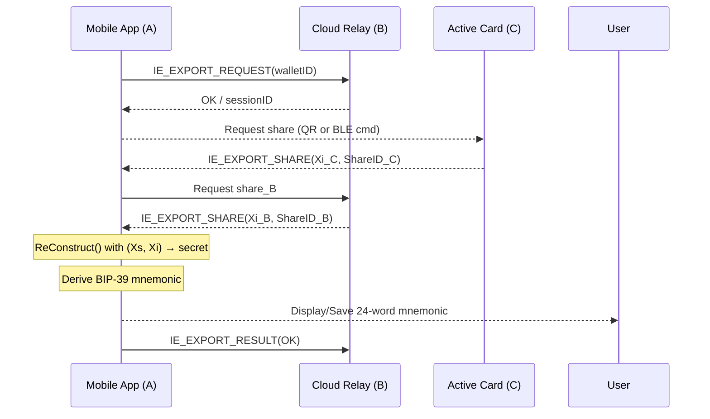
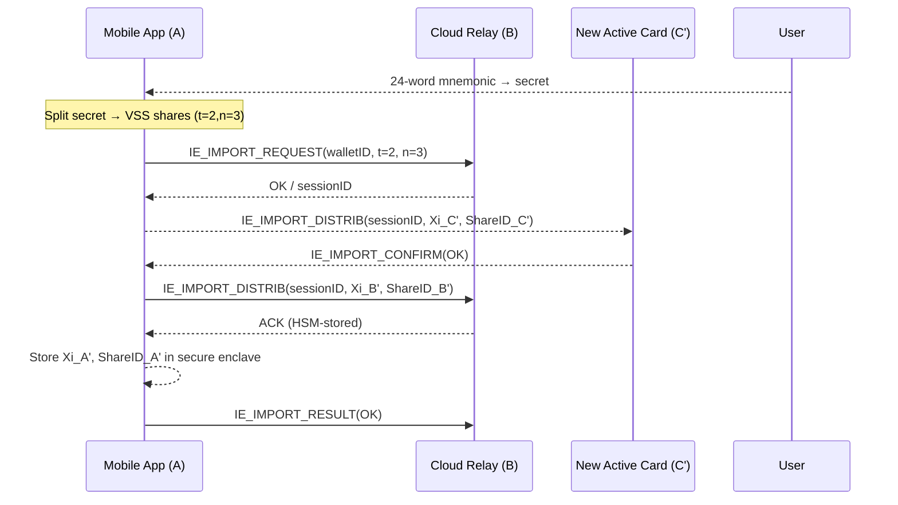

# Active Card and Mobile App BLE Import / Export Flow (2‑of‑3 MPC)

This specification adapts the Key Import & Export procedure to the BLE ↔ gRPC transport stack shared by Active Card (C), Mobile App (A), and Cloud Relay (B). It covers both exporting a wallet’s secret (to mnemonic form) and importing that mnemonic back into a fresh 2‑of‑3 MPC group.

---

## 0. Transport Summary

| Link         | Transport                  | Security                                 |
|--------------|-----------------------------|-------------------------------------------|
| Pi (C) ⇄ Mi (A) | BLE GATT Write‑With‑Response | AES‑GCM in `TransportMessageWrapper`     |
| Mi (A) ⇄ S (B)  | gRPC bidirectional stream    | TLS 1.3 + per‑message AES‑GCM             |
| Pi (C) ⇄ S (B)  | Proxied via Mi              | Double‑encrypted (BLE + gRPC)             |

New control ID ranges in `ActiveCardEvent`:

```kotlin
// Export control
IE_EXPORT_REQUEST  (1400)
IE_EXPORT_SHARE    (1401)
IE_EXPORT_RESULT   (1402)

// Import control
IE_IMPORT_REQUEST  (1500)
IE_IMPORT_DISTRIB  (1501)
IE_IMPORT_CONFIRM  (1502)
```

---

## 1. Export Flow (Get Mnemonic)

### 1.1 Participants & Threshold

- **A / Mobile** – secret holder, UI owner
- **C / Card** – provides its VSS share
- **B / Cloud** – optional third share

Threshold: `t = 2`, Parties: `n = 3`

### 1.2 Sequence Diagram



### 1.3 Control Messages (Protobuf)

```proto
message IEExportShare {
  bytes  session_id = 1;
  bytes  share_id   = 2;
  bytes  xi         = 3;
  string ec_type    = 4;
}
```

### 1.4 Cryptographic Details

- Share integrity: Verified via `Xi * G == Public_i`
- Secret reconstructed with `ReConstruct()`
- Encoded using **BIP‑39** mnemonic
- Secret wiped after delivery

---

## 2. Import Flow (Mnemonic → New Share Set)

### 2.1 Scenario

User holds mnemonic + 1 other shard (t=2), and wants to re‑provision a new Card (e.g. after loss).

### 2.2 Sequence Diagram



### 2.3 Share Generation

- Derived via “Key Gen from Mnemonic”
- Split to 3 shares with index
- ECIES‑encrypted for each recipient

### 2.4 Card Confirmation

- Decrypts and verifies shard
- Stores in flash
- Responds with `IE_IMPORT_CONFIRM(OK)`
- Fails with `ERR_CODE` if verification/persist fails

---

## 3. Error Codes (Export & Import)

| Code | Meaning              | Action                                 |
|------|----------------------|----------------------------------------|
| 1    | SHARE_NOT_FOUND      | Suggest 2‑of‑2 fallback                |
| 2    | BAD_SHARE            | Abort and show invalid party           |
| 3    | TIMEOUT              | Offer retry                            |
| 4    | PERSIST_FAIL         | Prompt user to re-seat or reset card   |

---

## 4. Security Notes

- **End‑to‑end encryption**: All Xi encrypted per recipient before wrapper
- **One‑time secrets**: RAM wiped after mnemonic/share use
- **HSM isolation**: Cloud never touches mnemonic
- **User education**: UI warns export is sensitive; mnemonic must be backed up offline
