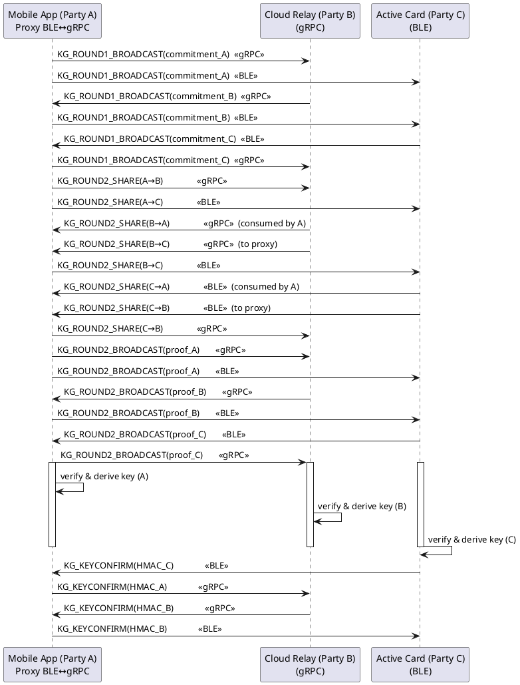

# Active Card and Mobile App BLE Key‑Gen Flow (2‑of‑3 MPC)

This document extends the **Active Card ⇄ Mobile** secure‑channel specification and defines how the parties run a 2‑of‑3 Threshold Signature Scheme (TSS) **Key‑Generation (Key‑Gen)** protocol over the same BLE transport.

---

## 0. Transport Layer

All Key‑Gen messages **reuse** the `TransportMessageWrapper` from the pairing workflow. Only the `message_type` field and the (encrypted) `contents` field change.

### 0.1 Message‑Type Range for Key‑Gen

```kotlin
// Reserved range 1000‑1999 for Key‑Gen
enum class ActiveCardEvent(val id: Int) {
    /* … existing pairing types 1‑11 … */

    // Key‑Gen round‑trip identifiers
    KG_ROUND1_BROADCAST(1001),   // Commitment distribution
    KG_ROUND2_SHARE(1002),       // Encrypted share delivery (unicast)
    KG_ROUND2_BROADCAST(1003),   // De‑commitment + Schnorr proof
    KG_KEYCONFIRM(1004),         // Optional key‑confirmation MAC

    // Error + control
    KG_ERROR(1010),              // Error report within Key‑Gen session
    KG_ABORT(1011)               // Abort entire Key‑Gen session
}
```

### 0.2 Wrapper → Payload Mapping

```
TransportMessageWrapper.message_type   →   Key‑Gen message kind (enum above)
TransportMessageWrapper.session_id     →   *Key‑Gen Session ID* (UUID v4)
TransportMessageWrapper.is_encrypted   =   true   // All Key‑Gen traffic is encrypted
```

---

## 1. Key‑Gen Overview

### 1.1 Participants & Roles (2‑of‑3)

| Symbol | Role | Party Letter | Notes |
|--------|------|--------------|-------|
| **Mi** | Mobile App (initiator) | **A** | Starts session & owns UI |
| **S**  | Cloud Relay           | **B** | Broadcast hub; preserves FIFO per session |
| **Pi** | Active Card (hardware)| **C** | Stores private share after completion |

### 1.2 Sequence Diagram *(transport‑aware, proxy‑correct)*

Below diagram enforces the rule:

* **Pi ↔ Mi** — BLE encrypted channel only. Pi never sees gRPC.
* **Mi ↔ S** — gRPC bidirectional only. S never speaks BLE.
* **Pi ↔ S** — strictly proxied **through Mi** (two hops).



*(All direct Pi ↔ S arrows have been removed; every hop now aligns with the BLE→gRPC proxy path.)*

---

## 2. Round‑by‑Round Message Definitions

All protobuf snippets are **logical**; keep wire‑compatibility with existing Go/Kotlin structs.

> **Threshold constants**: for this protocol revision `threshold_t = 2` and `num_parties_n = 3`. They are still encoded on‑wire to allow future 2‑of‑n upgrades, but implementations **MUST** reject sessions where `(t , n) ≠ (2 , 3)`.

### 2.1 Round 1 – Commitment Distribution

#### 2.1.1 `KGRound1Message`
```protobuf
message KGRound1Message {
  bytes session_id    = 1;  // Same as wrapper.session_id
  bytes key_identity  = 2;  // Distinguishes parallel wallets
  HashCommitment vss_commitment = 3; // Commitment to VSS polynomial
  uint32 threshold_t  = 4 [default = 2];  // Required signers
  uint32 num_parties  = 5 [default = 3];  // Total parties in session
  uint32 party_index  = 6;  // 1‑based index (A=1, B=2, C=3)
  uint64 monotonic_counter = 7; // Anti‑replay
}
```
*Transport mapping*: `message_type = 1001` (KG_ROUND1_BROADCAST).

### 2.2 Round 2 – Share Distribution & Proofs

#### 2.2.1 `KGRound2ShareMessage` *(unicast Pi → Pj)*
```protobuf
message KGRound2ShareMessage {
  bytes session_id   = 1;
  uint32 from_index  = 2; // sender (1‑3)
  uint32 to_index    = 3; // recipient (1‑3)
  bytes encrypted_share = 4; // ECIES(Pj_pk, share_ij)
  uint64 monotonic_counter = 5;
}
```
*Transport mapping*: `message_type = 1002` (KG_ROUND2_SHARE).

#### 2.2.2 `KGRound2BroadcastMessage` *(broadcast)*
```protobuf
message KGRound2BroadcastMessage {
  bytes session_id   = 1;
  uint32 party_index = 2; // sender (1‑3)
  HashDeCommitment decommitment = 3;
  bytes schnorr_proof_alpha_x = 4; // Compressed X coord
  bytes schnorr_proof_alpha_sig = 5; // Signature scalar
  uint64 monotonic_counter = 6;
}
```
*Transport mapping*: `message_type = 1003` (KG_ROUND2_BROADCAST).

### 2.3 Round 3 – Key Computation & Confirmation

No network messages are required to calculate the private share. Optionally, each party **confirms** it derived the same group public key.

#### 2.3.1 `KGKeyConfirmMessage`
```protobuf
message KGKeyConfirmMessage {
  bytes session_id   = 1;
  uint32 party_index = 2; // sender (1‑3)
  bytes mac_transcript = 3; // HMAC‑SHA256(all previous ciphertexts)
  uint64 monotonic_counter = 4;
}
```
*Transport mapping*: `message_type = 1004` (KG_KEYCONFIRM).

---

## 3. Error & Control Messages

```protobuf
message KGErrorMessage {
  bytes session_id = 1;
  uint32 party_index = 2; // which party reports
  uint32 error_code = 3;
  string description = 4;
}
```

| Code | Meaning | Recommended Action |
|------|---------|--------------------|
| `1` | `BAD_SHARE` | Abort; offending party shown in UI |
| `2` | `BAD_PROOF` | Abort |
| `3` | `TIMEOUT` | Retry whole Key‑Gen |
| `4` | `UNEXPECTED_MESSAGE` | Abort & reset state |

The initiator (Mobile, Party A) may broadcast `KG_ABORT` (`message_type = 1011`) to force teardown if any unrecoverable error occurs or the user cancels.

---

## 4. Security Considerations

1. **Replay protection** – every Key‑Gen payload includes `monotonic_counter`; parties reject duplicates or out‑of‑order counters.
2. **Confidentiality** – all shares use **ECIES** to their intended recipient *before* wrapper encryption, providing double confidentiality.
3. **Integrity** – wrapper’s AES‑GCM tag covers ciphertext; Schnorr proofs guarantee VSS commitments.
4. **Abort resilience** – upon `KG_ABORT` or network loss, devices wipe any intermediate secrets and require a new session.
