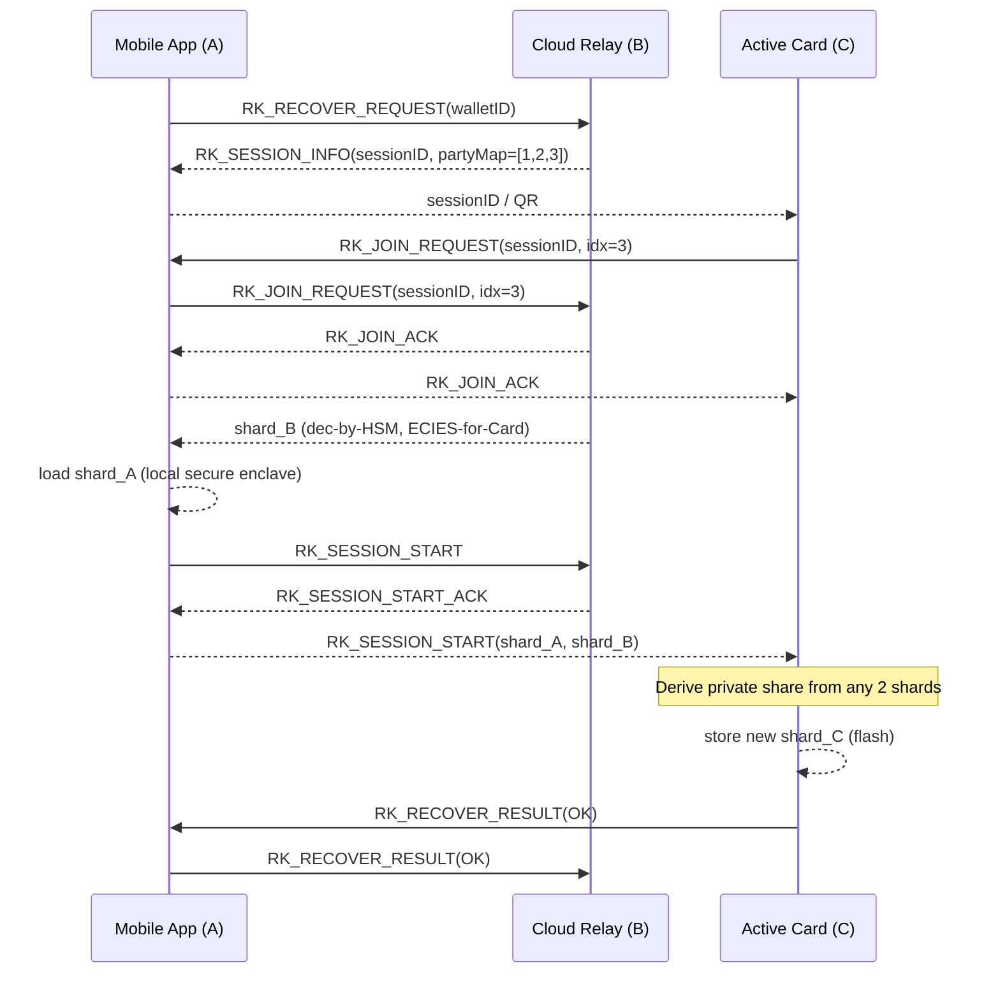

# Active Card and Mobile App BLE Recovery Flow (2‑of‑3 MPC)

This document maps the “Recovery (t‑of‑n)” procedure from the overall MPC design to the BLE ↔ gRPC transport used by Active Card (C), Mobile App (A), and Cloud Relay (B). It covers the common 2‑of‑3 configuration where the user recovers the Card’s lost share using Mobile + Cloud backup shards.

---

## 0. Transport Summary

| Link         | Transport                  | Security                                 |
|--------------|-----------------------------|-------------------------------------------|
| Pi (C) ⇄ Mi (A) | BLE GATT Write‑With‑Response | AES‑GCM inside `TransportMessageWrapper` |
| Mi (A) ⇄ S (B)  | gRPC bidirectional stream    | TLS‑1.3, per‑message AES‑GCM              |
| Pi (C) ⇄ S (B)  | Proxied via Mi              | Double-encrypted (BLE + gRPC)             |

Recovery re‑uses the `ActiveCardEvent` enum with reserved control IDs 1300–1304:

```kotlin
enum class ActiveCardEvent(val id: Int) {
    // ... pairing 1‑11, key‑gen 1001‑1011, backup 1200‑1203 ...
    RK_RECOVER_REQUEST  (1300),
    RK_SESSION_INFO     (1301),
    RK_JOIN_REQUEST     (1302),
    RK_SESSION_START    (1303),
    RK_RECOVER_RESULT   (1304)
}
```

---

## 1. High‑Level Sequence

### 1.1 Participants

- **Mi (A)** – Mobile App (initiator)
- **S (B)** – Cloud Relay / orchestrator
- **Pi (C)** – Active Card (needs recovery)

Threshold: `t = 2`, Parties: `n = 3 (A, B, C)`

### 1.2 Sequence Diagram (Transport-Aware)



---

## 2. Control Message Definitions

```proto
message RKRecoverRequest {
  string wallet_id = 1;
}

message RKSessionInfo {
  bytes session_id = 1;
  uint32 assigned_index = 2;
  repeated uint32 party_map = 3;
}

message RKJoinRequest {
  bytes session_id = 1;
  uint32 party_index = 2;
}

message RKSessionStart {
  bytes session_id = 1;
  bytes shard_A = 2;
  bytes shard_B = 3;
}

message RKRecoverResult {
  bytes session_id = 1;
  uint32 status_code = 2;
  string description = 3;
}
```

- `status_code != 0` → triggers UI error; Card discards partial data.

---

## 3. Cryptographic Flow

- **Shard Transport**: Each shard is encrypted using ECIES to the Card’s BLE key before final transport layer encryption.
- **Verification**: Card checks VSS commitments; failures yield `status_code = 2`.
- **Reconstruction**: Uses Shamir’s Recover() on (index=1, shard_A) and (index=2, shard_B).
- **Persistence**: Derived share is securely stored in Card flash memory with device master key.

---

## 4. Error Codes

| Code | Stage      | Meaning                          | UI Action                         |
|------|------------|----------------------------------|-----------------------------------|
| 1    | Fetch      | Cloud could not locate shard_B   | Prompt user to retry              |
| 2    | Verify     | Shard failed VSS commitment check| Abort and report invalid shard    |
| 3    | Timeout    | Party did not join or respond    | Offer retry                       |
| 4    | Reconstruct| Less than t valid shards         | Abort and notify user             |

---

## 5. Security Notes

- **Minimal Trust**: Cloud sees only its own shard. Mobile re-encrypts Cloud shard securely.
- **Session Hygiene**: UUID-v4 session IDs expire after 15 minutes.
- **Offline-Capable**: If t=2 and user owns another Card, they can restore offline via direct scan (not covered here).
