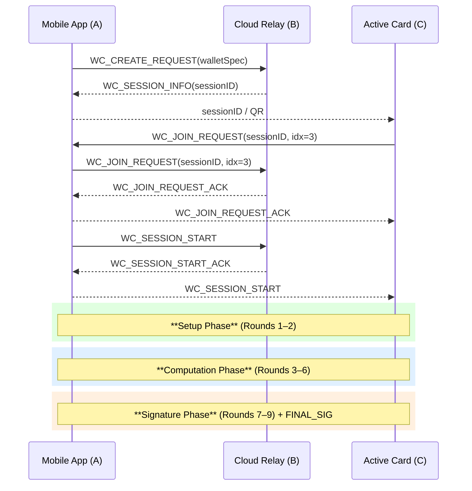
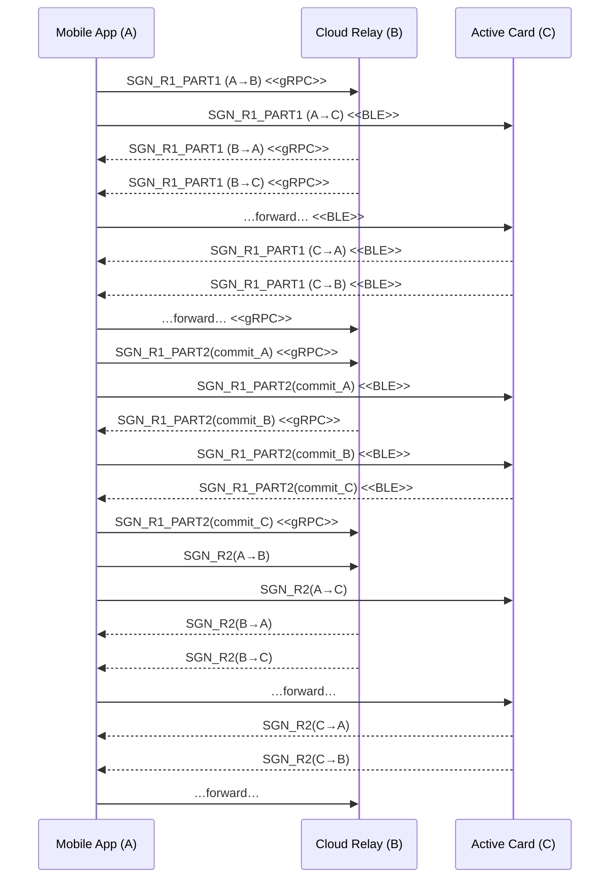
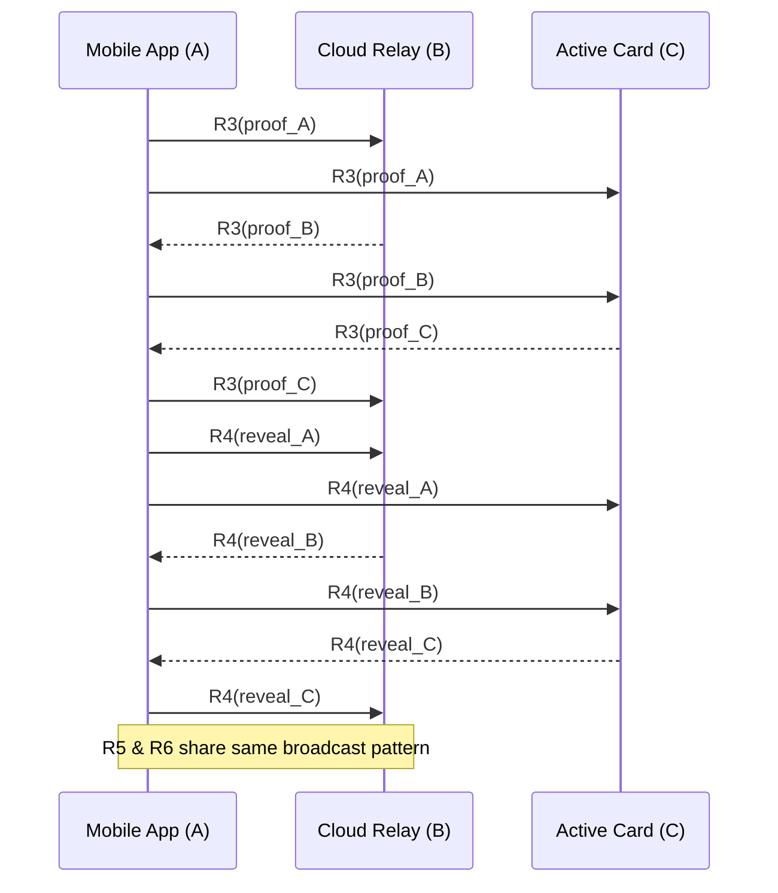
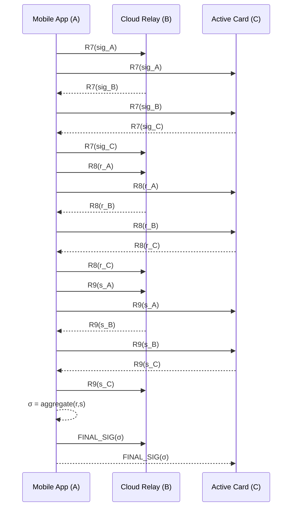

# Active Card and Mobile App BLE Signing Flow (ECDSA 2‑of‑3)

This revision aligns the on‑device workflow with the **three‑phase / nine‑round ECDSA signature protocol** shown in the canonical overview diagrams (Setup → Computation → Signature). The tables below map each protocol round to a concrete `ActiveCardEvent` ID and clarify how messages travel across the **BLE ⇆ gRPC proxy**.

---

## 0  Transport Links & Security

| Link | Transport | Security |
|------|-----------|----------|
| **Pi (C) ⇄ Mi (A)** | BLE GATT Write‑With‑Response | AES‑GCM in `TransportMessageWrapper` |
| **Mi (A) ⇄ S (B)** | gRPC bidirectional stream | TLS‑1.3 + message‑level AES‑GCM |
| **Pi (C) ⇄ S (B)** | *Via Mi* (`Pi → Mi → S`, `S → Mi → Pi`) | Double encryption (BLE + gRPC) |

---

## 1  Event ID Allocation

```kotlin
enum class ActiveCardEvent(val id: Int) {
    /* pairing 1‑11, key‑gen 1001‑1011, wallet 1100‑1111 */

    // Control plane
    SGN_CREATE_REQUEST (1200),
    SGN_SESSION_INFO   (1201),
    SGN_JOIN_REQUEST   (1202),
    SGN_SESSION_START  (1203),

    // === Setup Phase ===
    SGN_R1_PART1 (1204),
    SGN_R1_PART2 (1205),
    SGN_R2       (1206),

    // === Computation Phase ===
    SGN_R3 (1207),
    SGN_R4 (1208),
    SGN_R5 (1209),
    SGN_R6 (1210),

    // === Signature Phase ===
    SGN_R7 (1211),
    SGN_R8 (1212),
    SGN_R9 (1213),

    SGN_FINAL_SIG (1214),
    SGN_ERROR     (1215)
}
```

---

## 2 Sequence Overview (high‑level)

A concise diagram shows only the control‑plane handshake and the three collapsed phases. The detailed round diagrams remain unchanged below.



## 3  Sequence Diagrams by Phase

### 3.1 Setup Phase (Rounds 1‑2)



### 3.2 Computation Phase (Rounds 3‑6)



### 3.3 Signature Phase (Rounds 7‑9)



---

## 4  Round‑to‑Event Mapping

| Phase | Round | Event ID |
|-------|-------|----------|
| Setup | R1‑P1 | 1204 |
|  | R1‑P2 | 1205 |
|  | R2 | 1206 |
| Computation | R3 | 1207 |
|  | R4 | 1208 |
|  | R5 | 1209 |
|  | R6 | 1210 |
| Signature | R7 | 1211 |
|  | R8 | 1212 |
|  | R9 | 1213 |

---

## 5  Error Codes

| Code | Phase | Meaning |
|------|-------|---------|
| 1 | Create | Malformed tx |
| 2 | Join/Setup | Party index error |
| 3 | Comp | Share invalid |
| 4 | Sig | Partial σ fail |

`SGN_ERROR {code, description}`.
