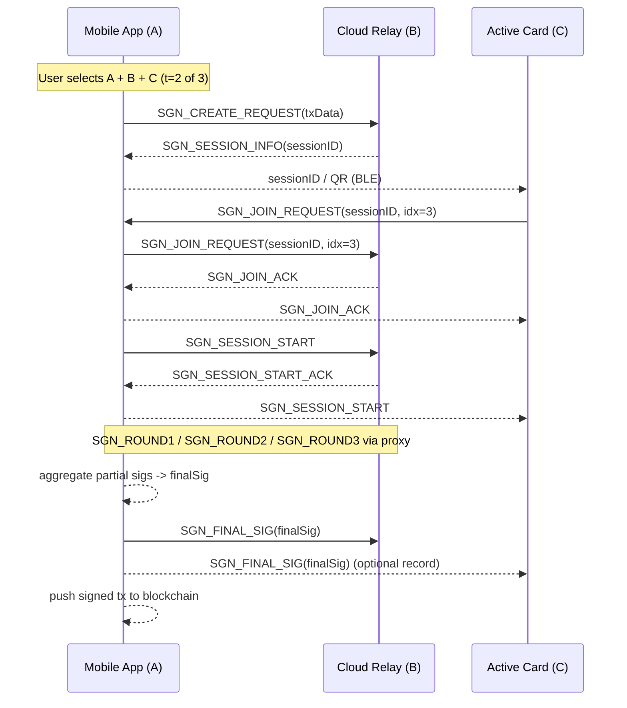

# Active Card and Mobile App BLE Signing Flow (Transaction Signing 2‑of‑3)

This document maps the **“transaction signing flow”** from the t‑of‑n MPC overview onto the BLE ↔ gRPC transport model used by **Active Card (C)**, **Mobile App (A)**, and **Cloud Relay (B)**.

---

## 0. Transport Summary

| Link | Transport | Security |
|------|-----------|----------|
| **Pi (C) ⇄ Mi (A)** | BLE GATT Write‑With‑Response | AES‑GCM inside `TransportMessageWrapper` |
| **Mi (A) ⇄ S (B)** | gRPC bidirectional stream | TLS‑1.3, per‑message AES‑GCM |
| **Pi (C) ⇄ S (B)** | *Proxied* (`Pi → Mi → S`, `S → Mi → Pi`) | Double‑encrypted (BLE + gRPC) |

All signing control frames and round messages extend the `ActiveCardEvent` enum (IDs 1200‑1210).

```kotlin
enum class ActiveCardEvent(val id: Int) {
    /* … pairing 1‑11, key‑gen 1001‑1011, wallet‑create 1100‑1111 … */

    SGN_CREATE_REQUEST  (1200), // A→B  start signing (tx bytes)
    SGN_SESSION_INFO    (1201), // B→A  session ID, party list
    SGN_JOIN_REQUEST    (1202), // C→B  Card joins session
    SGN_SESSION_START   (1203), // A→B  all joined → begin rounds

    SGN_ROUND1          (1204), // Commitment broadcast
    SGN_ROUND2          (1205), // Share + proof
    SGN_ROUND3          (1206), // Partial sig broadcast
    SGN_FINAL_SIG       (1207), // Aggregated signature (A)

    SGN_ERROR           (1210)  // Abort / error report
}
```

---

## 1. High‑Level Sequence

### Participants

* **Mi (A)** – Mobile App, holds user interface, *initiator*
* **S (B)** – Cloud relay / HSM shard
* **Pi (C)** – Active Card hardware wallet

Threshold: **t = 2**, Parties: **n = 3** (A, B, C)

### Sequence Diagram (transport‑aware)



*(The dotted “MPC signing” block uses round structures analogous to Key‑Gen, but with signing payloads.)*

---

## 2. Control Message Definitions

```protobuf
message SGNCreateRequest {
  bytes  tx_payload     = 1; // RLP-encoded, CBOR, etc.
  uint32 threshold_t    = 2; // 2
  uint32 num_parties_n  = 3; // 3
  string wallet_id      = 4; // which MPC group
}

message SGNSessionInfo {
  bytes  session_id         = 1;
  repeated uint32 party_map = 2; // order: A=1,B=2,C=3
}

message SGNJoinRequest {
  bytes  session_id  = 1;
  uint32 party_index = 2;
}
```

> **Round messages** (`SGN_ROUND1‑3`) mirror the structures in Key‑Gen but carry Schnorr/Taproot signing material instead of VSS data.

---

## 3. Signature Aggregation

1. Each party computes **partial signatures** σᵢ in `SGN_ROUND3`.
2. Mobile verifies σᴬ, σᴮ, σᶜ and aggregates them using MuSig2.
3. The final signature σ is embedded in the original transaction and broadcast.

---

## 4. Error Handling

| Code | Stage | Meaning |
|------|-------|---------|
| 1 | Create | Tx rejected (bad encoding, fee too high) |
| 2 | Join   | Unknown party / duplicate join |
| 3 | Start  | Not all selected parties joined in time |
| 4 | Round  | Invalid share / proof, abort session |

Errors are sent with `SGN_ERROR` (ID 1210). Mobile shows UX to retry or select new parties.

---

## 5. Security Notes

* Cloud and Card see only commitment hashes until signature rounds; they never view plaintext `tx_payload`.
* Mobile verifies all partial sigs before aggregation; MuSig2 rogue‑key mitigation is applied.
* Nonces follow BIP‑340 deterministic scheme with auxiliary RNG to prevent nonce reuse.

---

*Document version*: 15 May 2025  
Depends on: Key‑Gen Flow Rev 3a
