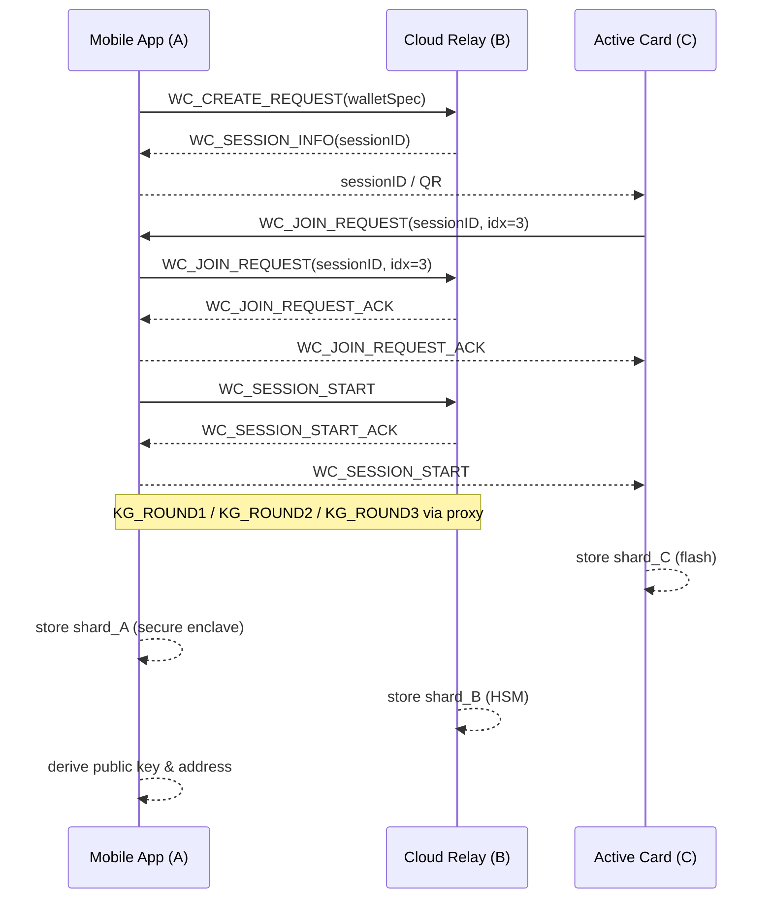

# Active Card and Mobile App BLE Wallet‑Creation Flow (Full MPC 2‑of‑3)

This specification maps the **“Creating a new wallet – Full MPC”** workflow from the t‑of‑n overview onto the BLE ↔ gRPC transport used by **Active Card (C)**, **Mobile App (A)**, and **Cloud Relay (B)**.

---

## 0. Transport Summary

| Link | Transport | Security |
|------|-----------|----------|
| **Pi (C) ⇄ Mi (A)** | BLE GATT Write‑With‑Response | AES‑GCM inside `TransportMessageWrapper` |
| **Mi (A) ⇄ S (B)** | gRPC bidirectional stream | TLS‑1.3, per‑message AES‑GCM |
| **Pi (C) ⇄ S (B)** | *Proxied* (`Pi → Mi → S`, `S → Mi → Pi`) | Double‑encrypted (BLE + gRPC) |

All control frames and MPC rounds reuse the `ActiveCardEvent` ID space; wallet‑creation adds a small control preamble (IDs 1100‑1103).

```kotlin
enum class ActiveCardEvent(val id: Int) {
    /* … pairing 1‑11, key‑gen 1001‑1011 … */

    WC_CREATE_REQUEST (1100), // A→B  Create new wallet request
    WC_SESSION_INFO   (1101), // B→A  Session ID + participant list
    WC_JOIN_REQUEST   (1102), // C→B  Join wallet/session
    WC_SESSION_START  (1103)  // A→B  All joined → start MPC rounds
}
```

---

## 1. High‑Level Sequence

### Participants

* **Mi (A)** – Mobile App, holds mnemonic, *initiator*
* **S (B)** – Cloud relay / orchestrator
* **Pi (C)** – Active Card hardware wallet

Threshold: **t = 2**, Parties: **n = 3** (A, B, C)

### Sequence Diagram (transport‑aware)



*(The dotted “MPC Key‑Generation” block references the full round logic from the **Key‑Gen Flow** document.)*

---

## 2. Control Message Definitions

```protobuf
message WCCreateRequest {
  uint32 threshold_t   = 1; // 2
  uint32 num_parties_n = 2; // 3
  string wallet_label  = 3; // user‑friendly name
}

message WCSessionInfo {
  bytes  session_id         = 1;
  uint32 assigned_index     = 2; // Mobile = 1 (A)
  repeated uint32 party_map = 3; // [1,2,3] where 2 = Cloud, 3 = Card
}

message WCJoinRequest {
  bytes  session_id  = 1;
  uint32 party_index = 2; // Card = 3
}
```
(ACK messages are empty wrappers re‑using the same IDs.)

---

## 3. Persisting Shards

| Party | Storage | Encryption Key |
|-------|---------|----------------|
| **Pi** | On‑card flash | Device master key (burned) |
| **Mi** | Secure enclave + user cloud backup | `SEK_mobile` |
| **S**  | HSM‑backed DB | `SEK_cloud` |

If the user later **adds/removes members** or **rotates threshold**, the **Key‑Reshare** workflow applies.

---

## 4. Error Handling

Wallet‑creation may abort *before* MPC rounds. Control‑plane errors use `WC_ERROR` (ID 1110) with codes:

| Code | Stage | Meaning |
|------|-------|---------|
| 1 | Create | Cloud rejected spec (e.g., unsupported *t,n*) |
| 2 | Join   | Duplicate or unknown `party_index` |
| 3 | Start  | Not all declared parties joined within timeout |

After `WC_SESSION_START`, any failure falls back to the Key‑Gen `KG_ERROR` codes.

---

## 5. Security Notes

* The mnemonic never leaves Mobile; Cloud and Card only see public data and encrypted shards.
* Session IDs are UUID‑v4 with 128‑bit randomness; replay attacks are blocked by single‑use policy in Cloud.
* All traffic between heterogeneous links is **end‑to‑end authenticated** via the AES‑GCM wrapper and X25519 ECDH keys as in the pairing spec.

---

*Document version*: 15 May 2025  
Depends on: Key‑Gen Flow Rev 3a
